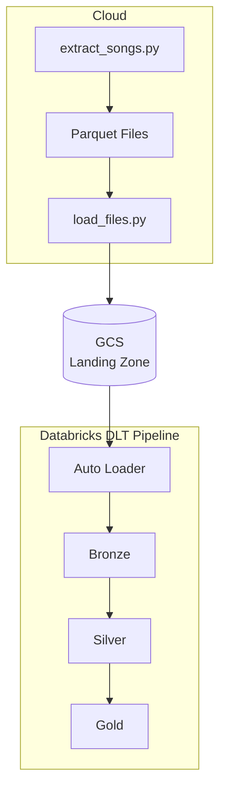

# Trending Songs Data Pipeline

A practical project to validate ingestion and transformation patterns with Delta Live Tables (DLT), Auto Loader, and Google Cloud Storage. Data flows from raw Parquet files through bronze, silver, and gold layers, fully orchestrated by a Databricks job.

In this architecture, extraction and upload to GCS run outside Databricks

## Architecture


Local Python scripts collect source data and write Parquet files. Those files are uploaded to GCS, where Auto Loader picks them up incrementally and feeds them into DLT pipelines. A Databricks Asset Bundle job orchestrates the full sequence.

## Project Structure

1. `src/extract_songs.py`: fetches and prepares source data.
2. `src/load_files.py`: uploads generated files to GCS.
3. `src/extract_files_gcs/transformations/auto_loader_extraction.py`: Auto Loader ingestion logic.
4. `src/songs_transformation/transformations/*.sql`: bronze, silver, and gold transformations.
5. `resources/pipelines.yml`: DLT pipeline definitions.
6. `resources/jobs.yml`: job orchestration and task dependencies.
7. `databricks.yml`: Databricks Asset Bundle configuration.

## Prerequisites

1. Python 3.13 or newer.
2. `uv` installed.
3. Google Cloud SDK (`gcloud`) installed.
4. Databricks CLI installed and configured.
5. Access to a Google Cloud project and a target GCS bucket.

## Setup

1. Install project dependencies.

```bash
uv sync
```

2. Authenticate with Google Cloud.

```bash
gcloud auth login
gcloud config set project <YOUR_PROJECT_ID>
gcloud auth application-default login
```

## Usage

1. Run extraction and upload outside Databricks.

You can run this locally:

```bash
uv run python src/extract_songs.py
uv run python src/load_files.py
```

You can also run the same scripts in Cloud Run Job orchestration.

2. Validate the Databricks bundle.

```bash
databricks bundle validate
```

3. Deploy the bundle.

```bash
databricks bundle deploy -p gcp-projects
```

4. Run the Databricks job that processes raw, bronze, silver, and gold layers.

```bash
databricks bundle run -p gcp-projects trending_songs_data_job
```

## Reference

1. https://docs.cloud.google.com/docs/authentication/provide-credentials-adc
