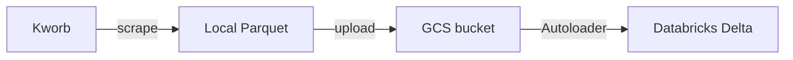
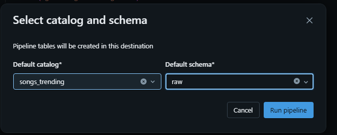
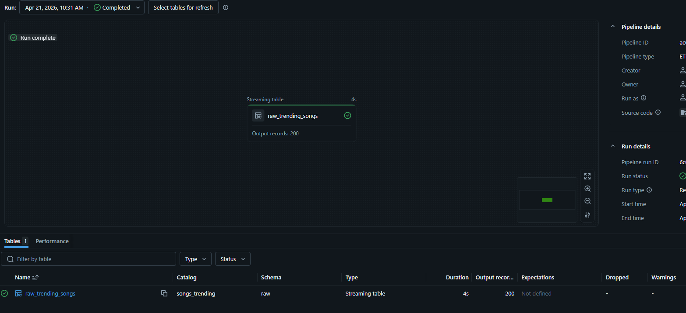

# Trending Songs

## Overview

This project builds an ingestion pipeline for worldwide trending songs from Kworb.

1. `src/extract_songs.py` scrapes the Kworb chart and writes Parquet files to `data/`.
2. `src/load_files.py` uploads Parquet files to the GCS bucket `songs-trending-data`.
3. Databricks Autoloader reads files from `gs://songs-trending-data`.
4. The Databricks pipeline writes to catalog `songs_trending`, schema `raw`.

## Architecture



## Project Structure

1. `src/extract_songs.py`: Scrapes Kworb and writes Parquet output.
2. `src/load_files.py`: Uploads local Parquet files to GCS.
3. `src/autoloader_folder/transformations/ingest_songs_files.py`: Databricks Autoloader table definition.
4. `data/`: Local Parquet output folder.

## Prerequisites

1. Python 3.13 or newer.
2. `uv` installed.
3. Google Cloud SDK (`gcloud`) installed.
4. Access to a Google Cloud project and a target GCS bucket.

## Setup

1. Install dependencies.

```bash
uv sync
```

## Authentication (ADC)

The uploader uses Google Application Default Credentials.

1. Log in with your Google account.

```bash
gcloud auth login
```

2. Set your active Google Cloud project.

```bash
gcloud config set project <YOUR_PROJECT_ID>
```

3. Create local ADC credentials.

```bash
gcloud auth application-default login
```

## Usage

1. Extract songs and generate Parquet files.

```bash
uv run python src/extract_songs.py
```

2. Confirm a Parquet file was generated under `data/`.

3. Upload Parquet files to GCS.

```bash
uv run python src/load_files.py
```

## Databricks Autoloader

The Autoloader logic is defined in `src/autoloader_folder/transformations/ingest_songs_files.py`.

1. It uses `spark.readStream.format("cloudFiles")`.
2. It reads Parquet files from `gs://songs-trending-data`.
3. It creates the streaming table `raw_trending_songs`.
4. In Databricks, configure the pipeline target as catalog `songs_trending` and schema `raw`.

## Databricks UI

Selecting catalog and schema:

You can schedule the Autoloader pipeline in the Databricks UI to keep ingestion running automatically.

1. Open your pipeline in Databricks UI.
2. Set target catalog to `songs_trending` and schema to `raw`.
3. Add a schedule for continuous or periodic ingestion.



Pipeline finished running:



## Databricks Autoloader Target

Autoloader writes the ingested files to:

1. Catalog: `songs_trending`
2. Schema: `raw`

## Reference

1. https://docs.cloud.google.com/docs/authentication/provide-credentials-adc